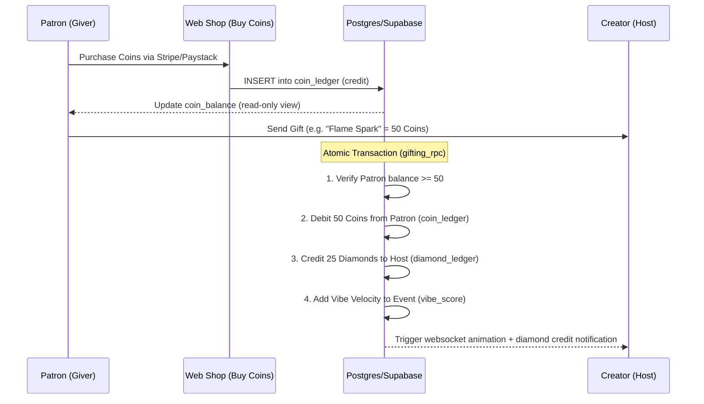

# Creator Monetization & Virtual Gifting Engine

This document outlines the end-to-end architecture, database schema, transactional workflows, and security requirements to build a virtual gifting and monetization system for **The Gruvs**. It is designed to be highly engaging, secure, and optimized for emerging markets (including South Africa via Paystack/Stripe Connect).

---

## 1. Core Philosophy: Why It Beats TikTok

TikTok's gifting system is purely transactional and passive. To make it more engaging and community-driven, we introduce the **Vibe Velocity Gifting Model**:

*   **Vibe Amplifiers**: Gifting doesn't just show an animation; it injects "Vibe Velocity" into the host's event, causing their venue to climb **The Lineup** (leaderboard) in real time. Fans are buying status for their favorite creators/venues.
*   **Squad Pools (Co-Gifting)**: Patrons in a Crew can pool their virtual coins to "buy a round" for an entire stream or venue, triggering a combined mega-animation.
*   **Aesthetic Takeovers**: High-tier gifts temporarily change the visual theme (e.g., neon lasers, glassmorphism glow) of the host's stream or profile card for all viewers.

---

## 2. Virtual Wallet Architecture (Double-Entry Ledger)

To ensure financial integrity and prevent double-spending, we use a **double-entry ledger** system. Virtual balances are never modified by direct `UPDATE` increments on a profile column. Instead, balances are computed from a read-only transaction ledger, or cached in a balance table that is audited against the ledger.



### Database Schema (SQL DDL)

```sql
-- ── 1. WALLET LEDGERS ────────────────────────────────────────────────────────
-- coin_ledger: Tracks coins bought by users (Purchased via Web Shop, no App Store cut)
CREATE TABLE public.coin_ledger (
  id          UUID PRIMARY KEY DEFAULT gen_random_uuid(),
  user_id     UUID REFERENCES public.profiles(id) ON DELETE RESTRICT,
  amount      INTEGER NOT NULL, -- Positive for purchase/credit, negative for spent/debit
  tx_type     TEXT NOT NULL CHECK (tx_type IN ('purchase', 'gift_spent', 'admin_adjustment', 'refund')),
  reference_id UUID,            -- Links to paystack_transactions or gift_logs
  created_at  TIMESTAMPTZ DEFAULT now()
);

-- diamond_ledger: Tracks diamonds earned by creators/hosts (convertible to cash)
CREATE TABLE public.diamond_ledger (
  id          UUID PRIMARY KEY DEFAULT gen_random_uuid(),
  user_id     UUID REFERENCES public.profiles(id) ON DELETE RESTRICT,
  amount      NUMERIC(12, 4) NOT NULL, -- Positive for gifts received, negative for cashout/withdrawals
  tx_type     TEXT NOT NULL CHECK (tx_type IN ('gift_received', 'withdrawal', 'admin_adjustment', 'withdrawal_reversal')),
  reference_id UUID,                   -- Links to gift_logs or cashout_requests
  created_at  TIMESTAMPTZ DEFAULT now()
);

-- ── 2. GIFT REGISTRY & LOGS ──────────────────────────────────────────────────
-- gift_registry: Configuration list of all available gifts
CREATE TABLE public.gift_registry (
  id          UUID PRIMARY KEY DEFAULT gen_random_uuid(),
  name        TEXT UNIQUE NOT NULL,
  coin_cost   INTEGER NOT NULL CHECK (coin_cost > 0),
  host_cut    NUMERIC(3, 2) NOT NULL DEFAULT 0.50, -- Percentage creator receives (e.g. 50%)
  lottie_url  TEXT NOT NULL,                       -- Vector animation asset URL
  tier        TEXT NOT NULL CHECK (tier IN ('spark', 'heat', 'legend')),
  is_active   BOOLEAN DEFAULT true,
  created_at  TIMESTAMPTZ DEFAULT now()
);

-- gift_logs: Audit log of all gift transactions
CREATE TABLE public.gift_logs (
  id          UUID PRIMARY KEY DEFAULT gen_random_uuid(),
  sender_id   UUID REFERENCES public.profiles(id) ON DELETE SET NULL,
  host_id     UUID REFERENCES public.profiles(id) ON DELETE SET NULL,
  event_id    UUID REFERENCES public.events(id) ON DELETE SET NULL,
  gift_id     UUID REFERENCES public.gift_registry(id) ON DELETE RESTRICT,
  coin_cost   INTEGER NOT NULL,
  diamonds_minted NUMERIC(12, 4) NOT NULL,
  created_at  TIMESTAMPTZ DEFAULT now()
);

-- Indexes for lightning-fast balance lookups
CREATE INDEX idx_coin_ledger_user ON public.coin_ledger(user_id);
CREATE INDEX idx_diamond_ledger_user ON public.diamond_ledger(user_id);
```

---

## 3. Transaction Workflow (Atomic Gifting RPC)

To prevent race conditions (e.g., a user sending the same 50 coins to two creators at the same millisecond), we lock the balance using PostgreSQL's row-level locking or atomic transactions inside a `SECURITY DEFINER` function.

### The Gifting RPC Function

```sql
CREATE OR REPLACE FUNCTION public.process_gift(
  p_sender_id UUID,
  p_host_id UUID,
  p_event_id UUID,
  p_gift_id UUID
)
RETURNS JSONB
LANGUAGE plpgsql
SECURITY DEFINER
SET search_path = public
AS $$
DECLARE
  v_coin_cost INT;
  v_host_cut NUMERIC(3,2);
  v_diamonds_minted NUMERIC(12,4);
  v_sender_balance INT;
  v_gift_log_id UUID;
BEGIN
  -- 1. Get gift details and lock row to ensure integrity
  SELECT coin_cost, host_cut INTO v_coin_cost, v_host_cut
  FROM public.gift_registry
  WHERE id = p_gift_id AND is_active = true
  FOR SHARE;

  IF NOT FOUND THEN
    RAISE EXCEPTION 'Gift type not found or is currently inactive.';
  END IF;

  -- 2. Compute current coin balance of sender
  SELECT COALESCE(SUM(amount), 0) INTO v_sender_balance
  FROM public.coin_ledger
  WHERE user_id = p_sender_id;

  -- 3. Check if sender has enough coins
  IF v_sender_balance < v_coin_cost THEN
    RAISE EXCEPTION 'Insufficient coin balance. Need % coins, only have %.', v_coin_cost, v_sender_balance;
  END IF;

  -- 4. Calculate diamond yield (TikTok style: Coins -> Diamonds conversion)
  -- 1 Coin = 1 Diamond (valued at $0.01 / R0.18). Creator gets their cut.
  v_diamonds_minted := v_coin_cost * v_host_cut;
  v_gift_log_id := gen_random_uuid();

  -- 5. Insert gift log
  INSERT INTO public.gift_logs (id, sender_id, host_id, event_id, gift_id, coin_cost, diamonds_minted)
  VALUES (v_gift_log_id, p_sender_id, p_host_id, p_event_id, p_gift_id, v_coin_cost, v_diamonds_minted);

  -- 6. Debit coins from sender
  INSERT INTO public.coin_ledger (user_id, amount, tx_type, reference_id)
  VALUES (p_sender_id, -v_coin_cost, 'gift_spent', v_gift_log_id);

  -- 7. Credit diamonds to creator/host
  INSERT INTO public.diamond_ledger (user_id, amount, tx_type, reference_id)
  VALUES (p_host_id, v_diamonds_minted, 'gift_received', v_gift_log_id);

  -- 8. Boost event's live vibe score (The Leaderboard booster!)
  UPDATE public.events 
  SET vibe_score = vibe_score + (v_coin_cost * 1.5)
  WHERE id = p_event_id;

  RETURN jsonb_build_object(
    'success', true,
    'gift_log_id', v_gift_log_id,
    'coins_spent', v_coin_cost,
    'diamonds_earned', v_diamonds_minted
  );
END;
$$;
```

---

## 4. Withdrawal (Cash-Out) & Compliance Gateway

Withdrawals involve actual fiat currency leaving your business bank account. To remain fully legal and compliant, **never hold money directly** or execute withdrawals manually. You must delegate payouts to a compliant provider.

```
Host requests withdrawal ──▶ Compliance Check (KYC) ──▶ Gateway Payout API ──▶ Real Bank Account
```

### Integrations

| Feature | Paystack (South Africa/Nigeria) | Stripe Connect (US/Europe/Global) |
| :--- | :--- | :--- |
| **API Endpoint** | `/transfer` | `/v1/transfers` |
| **Verification** | Paystack Resolve Card/Account API | Stripe Identity verification |
| **KYC Check** | ID number + Bank Account verification | Full Stripe onboarding (Express dashboard) |
| **Cost** | Fixed rate (e.g. R10 per transfer) | Percentage-based |

### Secure Withdrawal Steps & Schema

1.  **Host submits request**: Creator specifies the payout amount in Diamonds (with a minimum threshold, e.g., 500 Diamonds = R90).
2.  **Lock Balance**: Creator's diamond balance is debited immediately by entering a negative amount in `diamond_ledger` with `tx_type = 'withdrawal'` (status = `pending`).
3.  **Security Audit**: A background worker checks for fraud (e.g., check if the user recently bought coins using stolen cards and gifted themselves to wash the money).
4.  **Execute Transfer**: Run API call to payment gateway to deposit money directly into the creator's bank account.
5.  **Reconcile Status**: Update status to `completed`. If the transfer fails, insert a reverse transaction in `diamond_ledger` (`withdrawal_reversal`) to restore their balance.

```sql
CREATE TABLE public.cashout_requests (
  id              UUID PRIMARY KEY DEFAULT gen_random_uuid(),
  user_id         UUID REFERENCES public.profiles(id) ON DELETE RESTRICT,
  diamond_amount  NUMERIC(12, 4) NOT NULL,
  fiat_amount     NUMERIC(12, 2) NOT NULL, -- Payout in ZAR / USD after currency conversions
  currency        TEXT NOT NULL DEFAULT 'ZAR',
  status          TEXT NOT NULL DEFAULT 'pending' CHECK (status IN ('pending', 'processing', 'completed', 'failed')),
  gateway_ref     TEXT,                    -- Gateway payout/transfer ID
  error_message   TEXT,
  created_at      TIMESTAMPTZ DEFAULT now(),
  updated_at      TIMESTAMPTZ DEFAULT now()
);
```

---

## 5. Security & Anti-Fraud Action Items

Virtual money systems are primary targets for hackers and card fraudsters. Implement these controls:

1.  **The Web Coin Shop (No Mobile Cut)**: Set up a Stripe/Paystack card checkout page on your **website** (`the-gruvs-web`). When users click "Buy Coins" in the React Native app, open the browser to this page. This bypasses the 30% App Store cut, saving you massive profit margins.
2.  **Anti-Money Laundering (AML) Gating**: Implement a strict cooldown window (e.g., 48–72 hours) between purchasing coins and withdrawing diamonds to detect chargeback frauds.
3.  **Idempotent Transfers**: When calling Paystack/Stripe Connect payout APIs, always generate and send a unique `transfer_code` or `idempotency_key` based on the `cashout_requests.id`. This ensures that even if the network fails and retries, the creator is never paid twice.
4.  **Ledger Reconciliation Audits**: Set up a daily cron job that compares the sum of the ledgers against cached wallet balances. If there is a mismatch (indicating SQL injection or database hacking), flag the account and pause cashouts immediately.

---

## 6. How to Make This Dream Come True: Step-by-Step

To turn this plan into reality, follow these execution phases:

### Phase 1: Database & Ledger Deploy
*   Apply the SQL schema above to your live database.
*   Deploy the `process_gift` RPC function.

### Phase 2: Web Coin Shop Setup
*   Create a simple checkout page on your website using Paystack or Stripe Checkout.
*   Set up a webhook handler to insert positive balances into `coin_ledger` on successful purchase confirmation.

### Phase 3: Mobile UI Gifting & WebSocket Integration
*   Build a circular scrolling tray of gifts (with icons, names, and costs) inside the live chat UI.
*   When a gift is sent, call the `process_gift` RPC.
*   On success, use Supabase Realtime Channels (WebSockets) to broadcast the `lottie_url` animation to all viewers watching that event.

### Phase 4: KYC & Stripe/Paystack Payout Setup
*   Integrate Paystack's **Transfers API** or Stripe Connect **Express Account** flow.
*   Allow creators to enter their banking details and trigger cashouts when their balance exceeds the threshold.

---
---

# 7. Critical Review & v2 Architecture (read this before building any of the above)

The v1 plan above is a good skeleton, but reviewed *to the core* it has **one
thesis-breaking design flaw, several exploitable security bugs, and an economics
problem that can sink the whole feature.** This section fixes each. Treat §1–6 as
the draft and §7 as the spec.

## 7.0 The verdict up front
This is **not a feature — it's a regulated fintech business** bolted onto the app.
The moment real money flows in and creator cash flows out, you inherit
chargebacks, KYC/AML duties, a balance-sheet liability (sold coins are money you
owe), tax, and store-policy risk. **Do not ship this first.** Ship Premium IAP +
B2B (`MONETIZATION.md`) first — those need no payouts, the app store is merchant
of record, and compliance is near-zero. Earn the audience, form the company,
build a cash float, *then* turn on gifting. Sequencing this wrong can get the app
pulled or you personally liable.

## 7.1 #1 THESIS BREAK — gifts must NOT buy Lineup position
v1 step 8 does `UPDATE events SET vibe_score = vibe_score + coin_cost*1.5`. That
makes **The Lineup pay-to-win** — the exact opposite of the founding promise
("you climb by packing the place, not paying"; MASTERPIECE #36, the Truth
Protocol). Money faking heat is the TikTok attention-trap you're trying to beat.

**Fix:** gifts feed a **separate, clearly-labelled "Support" signal**, never the
verified-presence heat that ranks the Lineup. Two independent axes:
- **Heat** = verified bodies in the room (Touch Downs). Ranks the Lineup. Unbuyable.
- **Support** = gifts/tips. Shown as its own badge ("💎 Top supported host"), on its
  own board if you want one. Never mixed into heat.

This is also your *better-than-TikTok* angle: gifting is honest **tipping for real
value**, not buying rank. Keep "Squad Pools" and tasteful animations — drop
"Vibe Velocity injects Lineup position" and "Aesthetic Takeovers" (see 7.5).

## 7.2 #2 SECURITY — never trust client-supplied identity or rates
The v1 RPC takes `p_sender_id` as a parameter and the service computes
`fiat_amount` on the client (`requestCashout(userId, amount, ZARPerDiamond=0.18)`).
Both are exploitable: a client can spend another user's coins, or pass
`ZARPerDiamond = 999` to inflate a payout.

**Fixes (non-negotiable):**
- In every `SECURITY DEFINER` function, derive the actor from **`auth.uid()`**, never
  a parameter. `process_gift(p_host_id, p_event_id, p_gift_id)` — sender = `auth.uid()`.
- The **diamond→fiat rate lives server-side** (a config table), never passed from the
  client. The client may *display* an estimate (see `src/utils/giftEconomics.js`)
  but the authoritative number is computed in the cashout RPC.
- Lock down RLS: ledgers are **insert-via-RPC-only**; users can `SELECT` only their
  own rows. No client `INSERT`/`UPDATE`/`DELETE` on any ledger or `cashout_requests`.

## 7.3 #3 CORRECTNESS — the balance reads are broken today
`monetizationService.getCoinBalance` / `getDiamondBalance` call
`.from('coin_ledger').select('amount')` **with no `.eq('user_id', userId)`** — they
sum *everyone's* ledger (wrong balance + a privacy leak), and they fetch every row
to the client to add a number (won't scale past a few thousand gifts).

**Fixes:**
- Add `.eq('user_id', userId)` immediately (or rely on a strict RLS policy — but do
  both; never let a SUM's correctness depend only on RLS).
- Replace client-side summation with a **server aggregate**: a `wallet_balances`
  view (or a cached `balance` column updated *inside* the RPC and reconciled
  nightly). The client reads one number, not N rows.
- The friendly-error contract is also drifted: the service checks for
  `'INSUFFICIENT_COINS'` but the SQL raises `'Insufficient coin balance…'`. Raise a
  stable `ERRCODE`/sentinel (e.g. `RAISE EXCEPTION ... USING ERRCODE='GR001'`) and
  match on that, not on prose.

## 7.4 #4 ATOMICITY & IDEMPOTENCY — cashout and double-tap
- `requestCashout` does read-balance → insert-request → insert-debit as **three
  separate client calls**. That's a TOCTOU race: fire two at once and overdraw. The
  client-side "rollback delete" can itself fail. **Make cashout a single
  `SECURITY DEFINER` RPC** that locks the balance, re-checks it, writes the debit
  and the request in one transaction — exactly like `process_gift`.
- `process_gift` has **no idempotency**: a network retry or double-tap double-charges.
  Add a client-generated `idempotency_key UUID` with a `UNIQUE` constraint on
  `gift_logs`; on conflict, return the original result instead of charging again.
- Same idempotency key pattern on the **payout transfer** to the PSP (the v1 plan
  gets this part right — keep it).

## 7.5 #5 ECONOMICS — the store tax can eat the whole feature
Apple/Google take **30% (15% small-business)** on in-app digital goods. The v1
"open the web browser to buy coins" instinct is right, **but**:
- Apple guideline **3.1.1** forbids using IAP-purchased-elsewhere digital content
  in-app, and anti-steering rules restrict even *linking out* (loosened in the US
  post-2024, **not** globally).
- The **person-to-person gift exemption** (0% fee) only applies if the gift is
  genuinely P2P and the sender receives **no digital goods**. v1's "Aesthetic
  Takeovers," themed glows and animations are digital goods → they **forfeit the
  exemption** and re-trigger the 30%. So the flashy features literally tax you.

**Show the user the truth.** The shipped `src/utils/giftEconomics.js` +
`giftEconomics.test.js` compute the honest split so the gift sheet can say
*"You pay R20 · host gets R10 (50%)"* — and on iOS via IAP it would read **35%**.
TikTok hides this; surfacing it is a trust differentiator. Real numbers:

| Channel | Buyer pays | Store tax | Platform 50% | **Creator nets** |
| :-- | --: | --: | --: | --: |
| Web shop | R20 | R0 | R10 | **R10 (50%)** |
| In-app IAP | R20 | R6 | R7 | **R7 (35%)** |

Conclusion: **sell coins on the web**, keep in-app gifts **animation-light and
P2P-framed**, and treat IAP top-ups as a convenience option you *know* costs 30%.

## 7.6 #6 FRAUD / AML — close the wash-trading loop
The dangerous attack: buy coins with a **stolen card** → gift a colluder (or
yourself via a second account) → cash out clean money → real cardholder charges
back → **you eat the loss**. v1's 48–72h cooldown helps but isn't enough.

**Add:**
- **KYC before first payout** (PSP Connect/Express handles ID + sanctions). No KYC,
  no cash-out — ever.
- **Hold period** on newly-earned diamonds (e.g. 7 days) covering the chargeback
  window; pay out only *settled* funds.
- **Velocity + concentration limits**: flag a host whose diamonds come from few
  senders, or senders whose first action is a big gift. Wash-trading shows up as
  low sender-diversity.
- A **platform cut that makes laundering lossy** (you keep ~50% → laundering R100
  costs the fraudster R50 + fees; rarely worth it).
- **Daily ledger reconciliation** (v1 §5.4 — keep it) with auto-pause on mismatch.

## 7.7 Corrected `process_gift` (signature + key lines)
```sql
-- sender is auth.uid(), NOT a parameter; idempotent; does NOT touch heat/vibe_score
CREATE OR REPLACE FUNCTION public.process_gift(
  p_host_id UUID, p_event_id UUID, p_gift_id UUID, p_idem UUID
) RETURNS JSONB LANGUAGE plpgsql SECURITY DEFINER SET search_path = public AS $$
DECLARE v_sender UUID := auth.uid(); v_cost INT; v_cut NUMERIC(3,2); v_diamonds NUMERIC(12,4); v_bal INT; v_log UUID;
BEGIN
  IF v_sender IS NULL THEN RAISE EXCEPTION 'auth required' USING ERRCODE='GR000'; END IF;
  -- idempotency: replay returns the original, never double-charges
  SELECT id INTO v_log FROM gift_logs WHERE idempotency_key = p_idem;
  IF FOUND THEN RETURN jsonb_build_object('success',true,'replayed',true,'gift_log_id',v_log); END IF;

  SELECT coin_cost, host_cut INTO v_cost, v_cut FROM gift_registry WHERE id=p_gift_id AND is_active FOR SHARE;
  IF NOT FOUND THEN RAISE EXCEPTION 'gift inactive' USING ERRCODE='GR002'; END IF;

  SELECT COALESCE(SUM(amount),0) INTO v_bal FROM coin_ledger WHERE user_id=v_sender;  -- (cache later)
  IF v_bal < v_cost THEN RAISE EXCEPTION 'insufficient coins' USING ERRCODE='GR001'; END IF;

  v_diamonds := v_cost * v_cut;  v_log := gen_random_uuid();
  INSERT INTO gift_logs(id,idempotency_key,sender_id,host_id,event_id,gift_id,coin_cost,diamonds_minted)
    VALUES (v_log,p_idem,v_sender,p_host_id,p_event_id,p_gift_id,v_cost,v_diamonds);
  INSERT INTO coin_ledger(user_id,amount,tx_type,reference_id)    VALUES (v_sender,-v_cost,'gift_spent',v_log);
  INSERT INTO diamond_ledger(user_id,amount,tx_type,reference_id) VALUES (p_host_id,v_diamonds,'gift_received',v_log);
  -- NOTE: deliberately NO update to events.vibe_score. Support ≠ verified heat.
  RETURN jsonb_build_object('success',true,'gift_log_id',v_log,'diamonds_earned',v_diamonds);
END; $$;
```
Mirror the same pattern for a new `request_cashout(p_diamonds, p_idem)` RPC:
`auth.uid()`, lock + re-check balance, server-side rate, write debit + request in
one transaction.

## 7.8 What YOU must do to make the dream real (the non-code checklist)
Building the code is ~20% of this. The other 80% is business/legal/ops:

1. **Register a company** (Pty Ltd in SA) + a **business bank account**. Personal
   accounts can't run this and expose you personally.
2. **PSP merchant account** — **Paystack** (SA/Nigeria first) and/or **Stripe
   Connect Express** (global). They KYC *you*, become merchant-of-record for coin
   sales, hold the float, and run creator payouts — so **The Gruvs never custodies
   fiat**. Confirm this structure with them in writing.
3. **Legal docs**: Virtual-Currency Terms (coins = a limited licence, non-refundable,
   no cash value except official payout), Creator Payout Agreement, updated Privacy
   (POPIA/GDPR), Refund/Chargeback policy. Use a lawyer for the VC terms.
4. **Tax**: VAT registration (SA threshold R1m turnover), treat sold-coins as
   deferred revenue, handle creator-income reporting/withholding.
5. **Compliance check**: confirm that using a licensed PSP as MoR keeps you out of
   "money transmitter / e-money issuer" territory in SA. Get this in writing before
   launch — it's the difference between a feature and a licensing breach.
6. **App-store declarations**: web coin shop for top-ups; keep in-app gifts P2P and
   light; be ready for review pushback. Read Apple 3.1.1 / 3.2.2 and Google's
   payments policy yourself.
7. **Operations**: fraud monitoring, payout reconciliation, support for "where's my
   money" tickets, and a **capital float** to cover chargebacks/payouts that land
   before revenue settles.
8. **Build order**: ledger + `process_gift` (Phase 0, no real money, against earned
   coins) → web coin shop + webhook (Phase 1) → KYC + payout RPC (Phase 2) → IAP
   top-ups (Phase 3). Each phase is independently shippable and testable.

## 7.9 What's already shipped toward this (in-repo, constraint-safe)
- `src/utils/giftEconomics.js` + `__tests__/giftEconomics.test.js` — the honest,
  server-rate-agnostic **split calculator** for the gift sheet (display/estimate
  only; the authoritative figure is the cashout RPC). 7 tests, green.
- v1 `monetizationService.js` / `GiftingModal.js` exist but **must not touch real
  money** until §7.2–7.8 are done; today they should run only against *earned*
  `vibe_coins`, with the balance-filter bug (7.3) fixed first.
